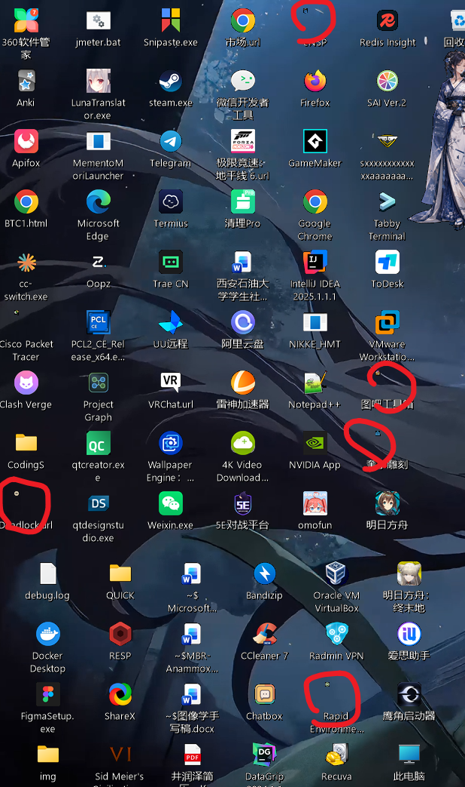
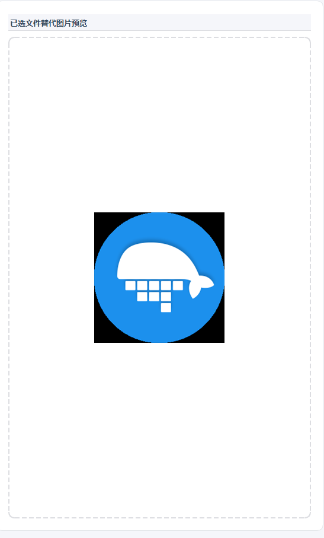

# 2026-06-13 问题记录

## 处理状态

以下问题均已修复并通过构建与自动测试。详细更新记录见：
[图标预览、尺寸与框选反馈修复](2026-06-13-icon-preview-size-and-selection.md)。

## 桌面图标异常缩小

部分低分辨率原生图标位于较大的透明画布中，整体缩放后实际图案会变得极小；自动排列此前还可能继续降低图标尺寸。

处理后，仅对透明留白异常大的原生图标进行条件裁边，且自动排列只调整位置，不再修改配置中的图标尺寸。

## 原生图标预览颠倒

Qt 读取 GDI+ 生成的底向上位图后，预览方向发生颠倒。

处理后，Qt 预览在转换位图时校正垂直方向。

## 群体框选反馈不明显

处理后，左键拖动框选会实时更新选中对象，选区边框和填充更清晰，已选对象会显示独立高亮。
